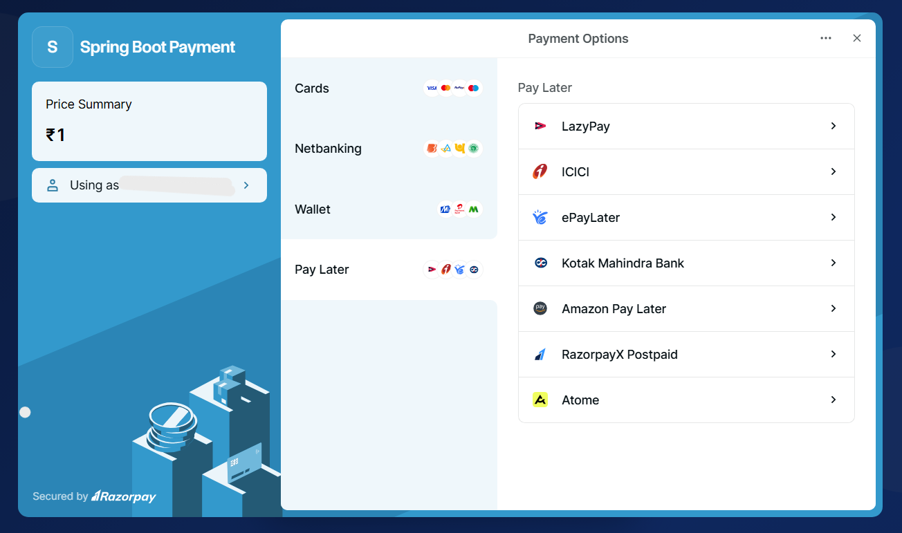
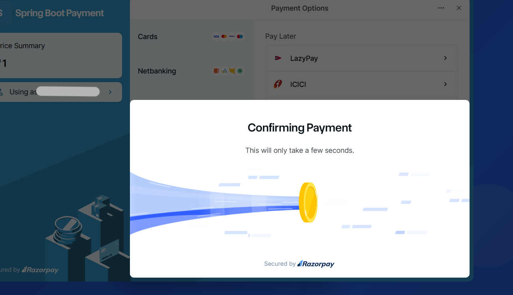
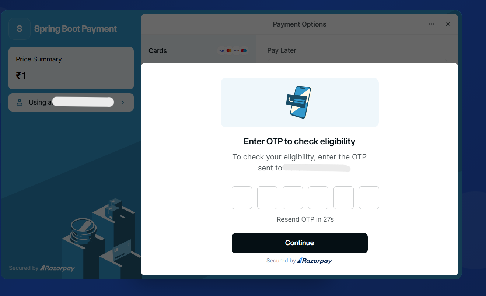
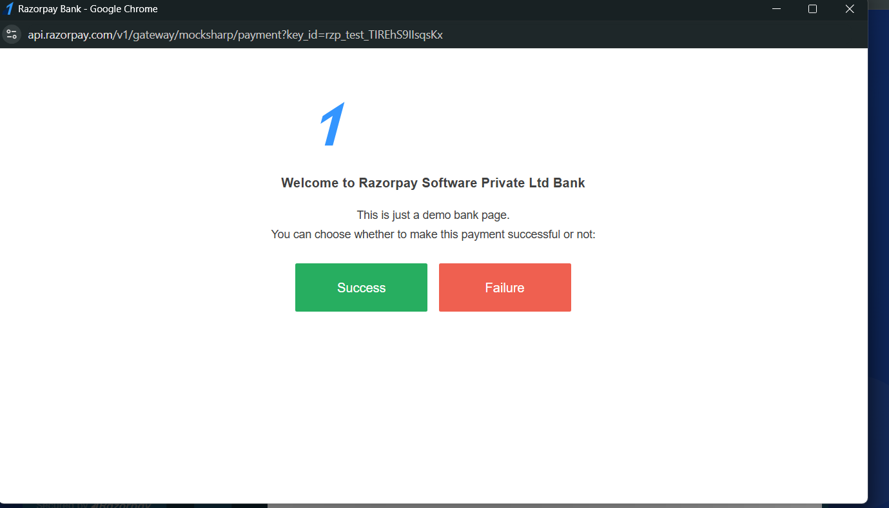
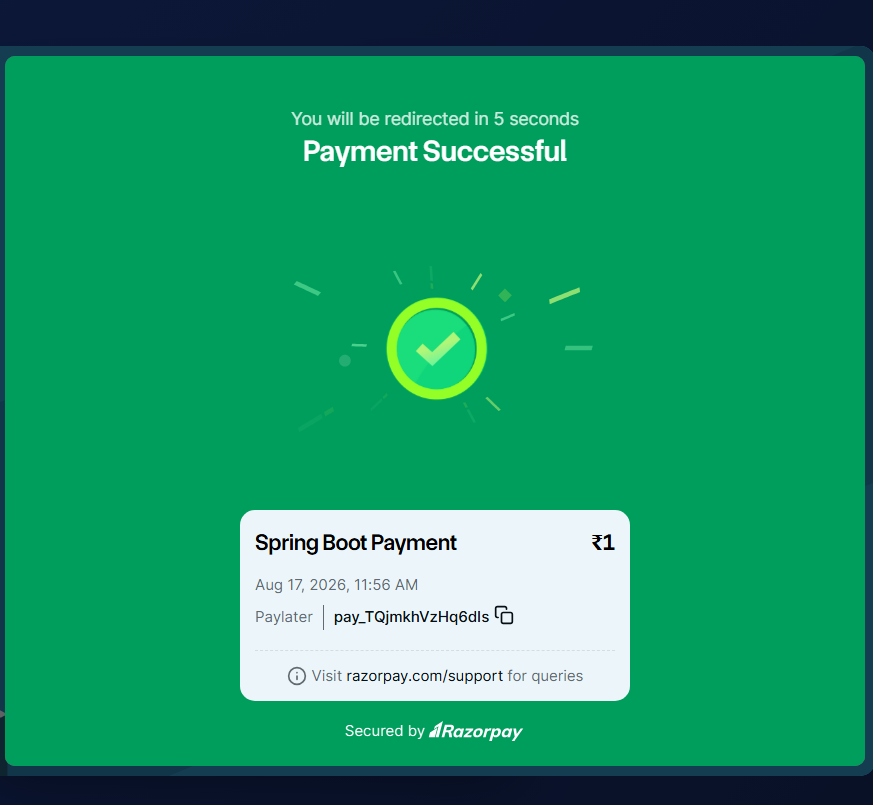

# 💳 Razorpay Payment Integration

> A modern online payment application built using **Java, Spring Boot, REST API, Razorpay Payment Gateway, HTML5, CSS3, and JavaScript**. The application allows users to enter a payment amount, creates a Razorpay payment order through a Spring Boot backend, and opens the Razorpay Checkout interface for payment.

---

## 📚 Table of Contents

- [Project Overview](#-project-overview)
- [Key Features](#-key-features)
- [Technology Stack](#️-technology-stack)
- [Screenshots / Demo](#️-screenshots--demo)
- [Architecture Overview](#️-architecture-overview)
- [How Payment Processing Works](#-how-payment-processing-works)
- [Project Structure](#-project-structure)
- [Installation & Setup](#-installation--setup)
- [Razorpay Configuration](#-razorpay-configuration)
- [Application Configuration](#-application-configuration)
- [API Documentation](#-api-documentation)
- [Request and Response](#-request-and-response)
- [Razorpay Checkout](#-razorpay-checkout)
- [Security](#-security)
- [Error Handling](#️-error-handling)
- [Testing](#-testing)
- [How to Run](#-how-to-run)
- [Future Improvements](#-future-improvements)
- [Learning Outcomes](#-learning-outcomes)
- [Contributing](#-contributing)
- [Author](#-author)
- [License](#-license)
- [Support](#-support)

---

## 📌 Project Overview

The **Razorpay Payment Integration** project is a web-based payment application developed using **Java and Spring Boot** with the **Razorpay Payment Gateway**.

The application provides a simple payment interface where users can enter an amount and initiate an online payment.

The frontend communicates with a Spring Boot REST API using the JavaScript Fetch API. The backend uses the Razorpay Java SDK to create a payment order. Once the order is successfully created, the order details are returned to the frontend and the Razorpay Checkout interface is opened.

### Main Workflow

```text
User
  ↓
Enter Payment Amount
  ↓
Frontend Validation
  ↓
Spring Boot REST API
  ↓
Razorpay Java SDK
  ↓
Create Razorpay Order
  ↓
Return Order Details
  ↓
Razorpay Checkout
  ↓
User Completes Payment
  ↓
Payment Response

This project demonstrates practical implementation of:

Java backend development
Spring Boot
REST API development
Razorpay payment gateway integration
JSON request handling
Frontend-backend communication
JavaScript Fetch API
Maven dependency management
Razorpay Checkout integration
✨ Key Features
💳 Razorpay Payment Integration

Integrates the Razorpay Payment Gateway to create payment orders and open the Razorpay Checkout interface.

💰 Dynamic Payment Amount

Users can enter the amount they want to pay through the payment interface.

🚀 Spring Boot REST API

Provides a REST endpoint for creating Razorpay payment orders.

⚡ Fetch API Integration

The frontend communicates with the Spring Boot backend using JavaScript Fetch API.

🔐 Backend Secret Key

The Razorpay secret key is intended to remain on the backend and should not be exposed in frontend JavaScript.

🎨 Modern User Interface

The payment page contains:

Gradient animated background
Glassmorphism-style payment card
Animated background elements
Payment amount input
Payment button
Loading indicator
Feature indicators
📱 Responsive Interface

The interface is designed using HTML5 and CSS3 and can be adapted for different screen sizes.

⚠️ Amount Validation

The application checks whether the entered amount is valid before creating the payment order.

⏳ Loading Indicator

Displays a loading message while the payment order is being created.

✅ Payment Callback

The Razorpay Checkout handler receives the payment response after successful payment.

🛠️ Technology Stack

| Technology                  | Purpose                        |
| --------------------------- | ------------------------------ |
| **Java 21**                 | Backend programming            |
| **Spring Boot**             | Backend framework              |
| **Spring Web MVC**          | REST API development           |
| **Razorpay Java SDK**       | Razorpay payment integration   |
| **HTML5**                   | Frontend structure             |
| **CSS3**                    | UI styling and animations      |
| **JavaScript**              | Frontend functionality         |
| **Fetch API**               | Frontend-backend communication |
| **Razorpay Checkout.js**    | Payment checkout interface     |
| **Maven**                   | Dependency management          |
| **Lombok**                  | Java boilerplate reduction     |
| **Eclipse / IntelliJ IDEA** | Development environment        |
| **Git**                     | Version control                |
| **GitHub**                  | Source code hosting            |
```
## 🖥️ Screenshots / Demo

The following screenshots demonstrate the complete payment flow from entering the amount to successful payment using the Razorpay Test Mode environment.

### 💳 1. Payment Landing Page

Users can enter the amount they want to pay and initiate the payment process.

<p align="center">
  
</p>

---

### 💰 2. Entering Payment Amount

The user enters the required payment amount before starting the transaction.

<p align="center">
  
</p>

---

### 💳 3. Razorpay Payment Options

After the backend creates the Razorpay order, the Razorpay Checkout interface displays the available payment methods.

<p align="center">
  
</p>

---

### 🔄 4. Payment Confirmation

Razorpay processes the payment request and displays the confirmation screen.

<p align="center">
  
</p>

---

### 🔐 5. OTP Verification

The Razorpay Test Mode payment flow displays OTP verification before completing the transaction.

<p align="center">
  
</p>

---

### 🏦 6. Razorpay Test Payment Gateway

The Razorpay Test Mode gateway allows the payment to be simulated using the available test options.

<p align="center">
  
</p>

---

### ✅ 7. Payment Successful

After successful completion of the test payment, Razorpay displays the payment success confirmation.

<p align="center">
  
</p>

🏗️ Architecture Overview

```
                    User
                      │
                      ▼
            HTML + CSS + JavaScript
                      │
                  Fetch API
                      │
                      ▼
             Spring Boot Controller
                      │
                      ▼
                 UserService
                      │
                      ▼
             Razorpay Java SDK
                      │
                      ▼
               Razorpay API
                      │
                      ▼
             Razorpay Checkout
                      │
                      ▼
              Payment Response
```
Backend Architecture

The backend follows a simple layered structure:
```
  Controller
      ↓
  Service
      ↓
  Razorpay SDK
      ↓
  Razorpay API

```
Components

Controller

Handles incoming HTTP requests and passes the payment amount to the service layer.

Service

Creates the Razorpay client and generates the payment order.

Entity

Contains the payment amount received from the frontend.

Frontend

Provides the user interface and communicates with the backend using Fetch API.

💰 How Payment Processing Works

Step 1 — Enter Amount

The user enters the amount in the payment interface.

Step 2 — Frontend Validation

JavaScript checks whether the entered amount is greater than zero.

Step 3 — API Request

The frontend sends a POST request to:

/payments

with the payment amount.

Step 4 — Spring Boot Controller

The UserController receives the request and extracts the payment amount.

Step 5 — Service Layer

The controller calls UserService.

Step 6 — Razorpay Client

The service creates a RazorpayClient using the Razorpay Key ID and Secret Key.

Step 7 — Create Order

The Razorpay Java SDK creates a payment order.

The amount is converted from rupees to paise because Razorpay expects the amount in the smallest currency unit.

Step 8 — Return Order

The Razorpay order information is returned to the frontend.

Step 9 — Open Checkout

JavaScript uses the returned order ID to open the Razorpay Checkout interface.

Step 10 — Complete Payment

The user completes the payment using Razorpay Test Mode.

📁 Project Structure

```
razorpay-payment-integration/
│
├── src/
│   ├── main/
│   │   ├── java/
│   │   │   └── com/example/razorpay/
│   │   │       │
│   │   │       ├── RazorpayApplication.java
│   │   │       │
│   │   │       ├── controller/
│   │   │       │   └── UserController.java
│   │   │       │
│   │   │       ├── entity/
│   │   │       │   └── User.java
│   │   │       │
│   │   │       └── service/
│   │   │           └── UserService.java
│   │   │
│   │   └── resources/
│   │       ├── application.properties
│   │       └── static/
│   │           └── index.html
│   │
│   └── test/
│
├── screenshots/
│   ├── payment-page.png
│   ├── amount-entry.png
│   ├── payment-options.png
│   ├── payment-confirmation.png
│   ├── otp-verification.png
│   ├── test-bank.png
│   └── payment-success.png
│
├── .gitignore
├── pom.xml
├── mvnw
├── mvnw.cmd
├── HELP.md
└── README.md
```

⚙️ Installation & Setup
Prerequisites

Make sure the following are installed:

Java JDK 21
Maven
Git
Eclipse / Spring Tool Suite / IntelliJ IDEA
Razorpay Account
Razorpay Test Mode credentials


Clone the Repository
git clone https://github.com/Madhu-shree-R/razorpay-payment-integration.git

Navigate to the Project
cd razorpay-payment-integration

Install Dependencies

Using Maven:
mvn clean install

Or using the Maven Wrapper:
Windows
mvnw.cmd clean install

Linux / macOS
./mvnw clean install

🔐 Razorpay Configuration

This project uses Razorpay Test Mode for payment processing.

You need:

Razorpay Key ID
Razorpay Key Secret
⚠️ Security Notice

Never upload your Razorpay Secret Key to GitHub.

Use environment variables instead.

Configure application.properties as:

spring.application.name=razorpay
razorpay.key.id=${RAZORPAY_KEY_ID}
razorpay.key.secret=${RAZORPAY_KEY_SECRET}
server.port=8081

Windows CMD
set RAZORPAY_KEY_ID=your_key_id
set RAZORPAY_KEY_SECRET=your_key_secret

Windows PowerShell
$env:RAZORPAY_KEY_ID="your_key_id"
$env:RAZORPAY_KEY_SECRET="your_key_secret"

Linux / macOS
export RAZORPAY_KEY_ID=your_key_id
export RAZORPAY_KEY_SECRET=your_key_secret

⚙️ Application Configuration

The application runs on port 8081.
spring.application.name=razorpay
server.port=8081

The frontend sends the payment request to:
http://localhost:8081/payments

🔌 API Documentation

Create Payment Order

Endpoint
POST /payments

Local URL
http://localhost:8081/payments

Content-Type
application/json

Request Body
{
    "amnt": 500
}

Example Request Using cURL
curl -X POST http://localhost:8081/payments \
-H "Content-Type: application/json" \
-d "{\"amnt\":500}"

Controller Flow
```
POST /payments
       ↓
UserController
       ↓
UserService
       ↓
RazorpayClient
       ↓
Razorpay Order
```

📦 Request and Response
Request

The frontend sends the payment amount as JSON:
{
    "amnt": 500
}

Processing

The backend receives the amount and creates a Razorpay order.

The amount is converted into paise before sending it to Razorpay.

For example:
```
₹500
  ↓
500 × 100
  ↓
50000 paise
```

Response

The backend returns the Razorpay order information to the frontend.

The frontend uses the order ID and amount to initialize Razorpay Checkout.

💳 Razorpay Checkout

The frontend initializes Razorpay Checkout using the Razorpay Checkout JavaScript library.

The checkout configuration contains:

Razorpay Key ID
Payment amount
Currency
Razorpay Order ID
Application name
Payment description
Payment handler
Theme configuration

The Razorpay Checkout interface provides the available payment methods supported by the test environment.


🔐 Security

The application follows basic security practices for payment integration.

Secret Key Protection

The Razorpay Secret Key should only be used on the backend.

It should never be placed inside frontend JavaScript.

Environment Variables

Sensitive credentials should be stored using environment variables:
RAZORPAY_KEY_ID
RAZORPAY_KEY_SECRET

GitHub Security

Do not commit:
Razorpay Secret Key
Production API credentials
Passwords
Private tokens
Personal credentials
⚠️ This project uses Razorpay Test Mode. Production payment systems require additional security measures, payment signature verification, validation, transaction persistence, and proper error handling.

⚠️ Error Handling

The application handles common payment input errors such as:

Empty payment amount
Invalid payment amount
Zero or negative amount
Payment order creation failure
Payment request failure

The frontend displays a validation message when an invalid amount is entered.
The backend handles RazorpayException during order creation.


🧪 Testing

The application can be tested using:

Postman
Web Browser
cURL
Razorpay Test Mode
Test Cases:
```
| Test Case       | Input              | Expected Result               |
| --------------- | ------------------ | ----------------------------- |
| Valid Amount    | `500`              | Razorpay Checkout opens       |
| Valid Amount    | `1000`             | Razorpay Checkout opens       |
| Empty Amount    | Empty              | Validation message            |
| Zero Amount     | `0`                | Validation message            |
| Negative Amount | `-100`             | Validation message            |
| Test Payment    | Razorpay Test Mode | Payment flow can be simulated |
```

▶️ How to Run

Step 1 — Configure Razorpay Credentials
Set your Razorpay Test Mode credentials using environment variables.

Step 2 — Start the Spring Boot Application
Using Maven:
mvn spring-boot:run
Or on Windows:
mvnw.cmd spring-boot:run

Step 3 — Open the Application
The application runs on:
http://localhost:8081

Step 4 — Enter Payment Amount
Enter an amount such as:
500

Step 5 — Click Pay Securely
Click:
Pay Securely →
The application sends the payment request to the Spring Boot backend.

Step 6 — Complete Test Payment
Razorpay Checkout opens and allows the payment to be simulated using Test Mode.

🔮 Future Improvements
The following features can be added in future versions:
🔐 Razorpay payment signature verification
🗄️ Store payment transactions in MySQL
👤 User authentication using JWT
📊 Payment history dashboard
📧 Payment confirmation emails
🧾 Generate payment receipts
📱 Enhanced mobile responsiveness
🔄 Payment status tracking
📈 Transaction reporting
🏗️ DTO-based request and response handling
🛡️ Improved exception handling
🗃️ Database-based transaction management
📋 Payment history and reporting

📚 Learning Outcomes
Through this project, I gained practical experience with:
Java 21
Spring Boot
Spring MVC
REST API Development
Dependency Injection
Razorpay Java SDK
Razorpay Checkout
Payment Order Creation
JavaScript Fetch API
JSON Request Handling
HTML5
CSS3
Maven
Exception Handling
Postman API Testing
Environment Variables

🤝 Contributing
Contributions, suggestions, and improvements are welcome.
Steps to Contribute

Step 1 : Fork the repository.
Step 2 : Create a new branch.
git checkout -b feature/new-feature
Step 3 : Make your changes.
Step 4 : Commit your changes.
git commit -m "Add new feature"
Step 5 : Push the branch.
git push origin feature/new-feature
Step 6 : Create a Pull Request.


👩‍💻 Author
Madhushree R

MCA Graduate | Java Developer | Full Stack Developer
Technical Skills
Core Java
Advanced Java
Spring Boot
REST API
MySQL
HTML5
CSS3
JavaScript
Git
GitHub

📄 License
This project is created for educational and portfolio purposes.

⭐ Support
If you find this project useful, consider giving the repository a ⭐ on GitHub.

Thank you for visiting this project! 🚀
